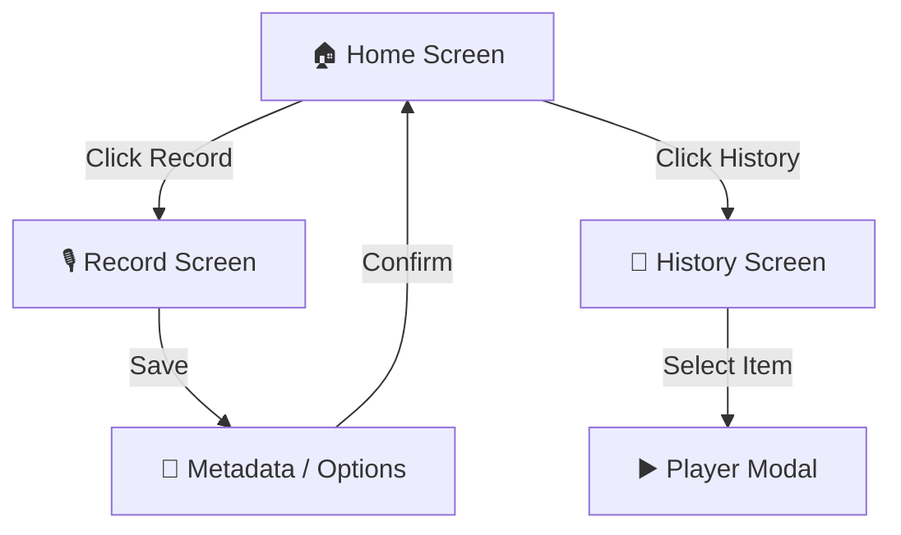

# 🗺️ User Flow / Navigation

Ce document décrit le parcours utilisateur et les différents écrans de l'application.

## 📱 Structure de Navigation

L'application utilise une "Stack Navigation" simple.

1.  **Home Screen (Accueil)**
    - **Header** : Date du jour.
    - **Contenu** :
        - Gros bouton "RECORD" (si pas encore fait aujourd'hui).
        - OU Lecteur "Note du jour" (si déjà fait).
    - **Footer** : Lien vers "History".

2.  **Record Screen (Modal)**
    - *S'ouvre quand on clique sur RECORD.*
    - **Actions** :
        - Start / Stop / Resume.
        - Save (Ouvre l'écran de métadonnées).
        - Cancel (Supprime le temp).

3.  **Metadata Screen (Après enregistrement - V1.1)**
    - **Champs** :
        - Titre (Optionnel).
        - Humeur (Emojis).
        - **Option "Capsule Temporelle"** : Sélecteur de date (Date Picker) pour déverrouillage futur.
    - **Action** : Valider (Sauvegarde finale).

4.  **History Screen (Historique)**
    - Liste scrollable des jours passés.
    - **États des items** :
        - 🟢 Disponible : Clic -> Joue l'audio.
        - 🔒 Verrouillé (Capsule) : Affiche "Disponible le [Date]".
        - ❌ Manqué : "Pas d'enregistrement".

## 🔄 Diagramme simplifié

